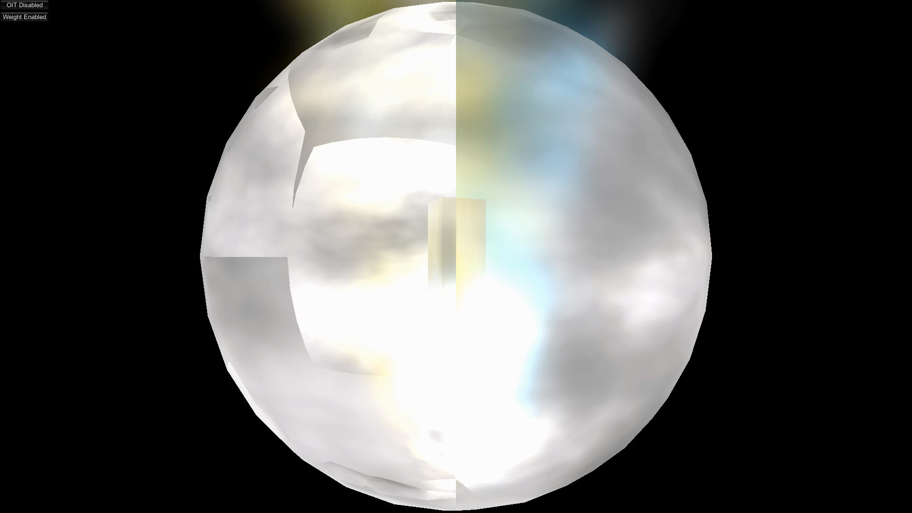

Order-Independent Transparency for Unity
==========
* OIT(Order-Independent Transparency)[1]

[Unity Package](WeightedOIT.unitypackage)

## References
 1. McGuire and Bavoil, Weighted Blended Order-Independent Transparency, Journal of Computer Graphics Techniques (JCGT), vol. 2, no. 2, 122--141, 2013 
